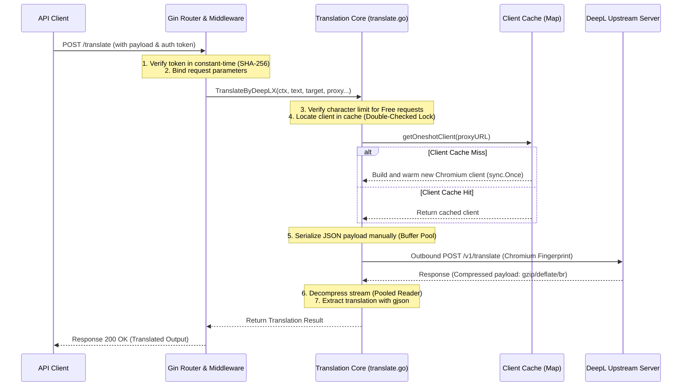

# DeepLX System Design & Architecture Explanation

This document explains the architectural principles, component design, security practices, and performance optimizations implemented in DeepLX.

---

## 1. High-Level Component Architecture

DeepLX is a stateless API proxy server. It translates local client API requests (either raw JSON or form-urlencoded parameters) into JSON payloads that match the exact shape of the DeepL Chrome Extension's internal communication.



---

## 2. Security Design Decisions

### SHA-256 Token Hashing to Prevent Timing Attacks
When comparing a client's supplied authorization token with the configured server token, standard string comparisons or naive byte-slice comparisons can return immediately when a character mismatch is detected. An attacker can analyze the server's response time to deduce the characters of the secret token one by one.

While `subtle.ConstantTimeCompare` compares byte slices in constant time, it still leaks the **length** of the token because it returns immediately if the lengths of the two slices are different.

To mitigate this, DeepLX hashes both tokens using SHA-256 before comparing them:
```go
hProvided := sha256.Sum256([]byte(providedToken))
hConfigured := sha256.Sum256([]byte(cfg.Token))
tokenMatch := subtle.ConstantTimeCompare(hProvided[:], hConfigured[:]) == 1
```
Because the output of SHA-256 is always exactly 32 bytes, the length of the secret token is never leaked, and comparison time is always constant.

### Privilege Separation in systemd Service
Running network services as the `root` user presents a severe security risk. If a remote code execution vulnerability is found in Go or Gin, an attacker could gain full root access to the system. DeepLX's `deeplx.service` defines a dedicated unprivileged user/group:
```ini
[Service]
User=deeplx
Group=deeplx
```
This limits the process execution context to an isolated shell environment.

---

## 3. High-Performance Optimizations

### Double-Checked Cache Locking
DeepLX utilizes `oneshotClients` (a thread-safe `sync.Map`) to cache outbound HTTP clients per proxy URL. Reusing the client keeps the TCP/TLS connections warm, saving ~200-400ms on subsequent translation requests.

To prevent concurrent requests from performing the heavy initialization of Chrome TLS fingerprints (using `req.C().ImpersonateChrome()`) during a cold start, the code uses a Mutex-guarded double-checked lock pattern:
```go
if val, ok := oneshotClients.Load(proxyURL); ok {
    return val.(*clientWrapper).client, nil
}
clientMu.Lock()
defer clientMu.Unlock()
if val, ok := oneshotClients.Load(proxyURL); ok {
    return val.(*clientWrapper).client, nil
}
// Initialize and store client wrapper
```

### Proxy-Isolated Cookie Jars & Warmups
DeepL leverages WAF checks to block automated traffic. By default, standard extensions load the site first to collect cookie values. 
1. **Cookie Jar Isolation**: Rather than utilizing a single global cookie jar (which causes lock contention and WAF correlation across proxy profiles), each proxy client wrapper holds its own `http.CookieJar`.
2. **Local Pre-Warming**: When a new proxy client is compiled, a background goroutine GETs the DeepL translator path once (`sync.Once`) to seed that client's local cookie jar with `userCountry` and TLS session tickets, pre-warming connections before a real user request is dispatched.

### JSON Serialization Without Reflection
By default, Go's `json.Marshal` utilizes runtime reflection to traverse structs, allocating multiple objects and buffers on the heap. Since the translation payload's structure is static (only the `text`, `source_lang`, and `target_lang` variables are dynamic), DeepLX serializes the JSON manually:
```go
buf := bufPool.Get().(*bytes.Buffer)
buf.Reset()
defer bufPool.Put(buf)

buf.WriteString(`{"text":[`)
buf.Write(textBytes)
buf.WriteString(`],"target_lang":"`)
...
```
This results in **zero allocations** for the static components, drastically reducing Garbage Collector (GC) overhead.

### Decompression Reader Pooling
Outbound client requests advertise support for `Accept-Encoding: gzip, deflate, br` to mimic Chrome's fingerprint. Consequently, manual decompression is required. Since allocating decoding buffers on every request is highly memory-expensive, readers are pooled using `sync.Pool` and reset upon reuse:
```go
func getGzipReader(r io.Reader) (*gzip.Reader, error) {
    if v := gzipReaderPool.Get(); v != nil {
        gr := v.(*gzip.Reader)
        if err := gr.Reset(r); err != nil {
            return nil, err
        }
        return gr, nil
    }
    return gzip.NewReader(r)
}
```
All readers are explicitly closed (`Close()`) and recycled, eliminating memory leaks (such as the unclosed flate reader leak in previous versions).
